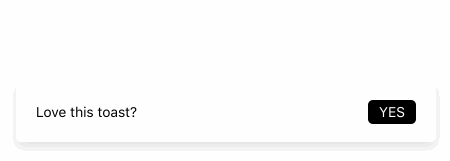

# @evillt/toast

> Display a brief toast at the browser

[](https://npmjs.com/package/@evillt/toast)
[](https://npmjs.com/package/@evillt/toast)
[](https://circleci.com/gh/evillt/toast/tree/master)
[](./LICENSE)
[](https://donate.evila.me)



## Install

```console
yarn add @evillt/toast
```

## Documentation

https://toast.evila.me

## Credits

- [zeit/design's toast](https://zeit.co/design/toast)

## Contributing

1. Fork it!
2. Create your feature branch: `git checkout -b my-new-feature`
3. Commit your changes: `git commit -am 'Add some feature'`
4. Push to the branch: `git push origin my-new-feature`
5. Submit a pull request :D

## Author

**toast** © [evillt](https://github.com/evillt), Released under the [MIT](./LICENSE) License.

Authored and maintained by **EVILLT** with help from contributors ([list](https://github.com/evillt/toast/contributors)).

> [evila.me](https://evila.me) · GitHub [@evillt](https://github.com/evillt) · Twitter [@evillt](https://twitter.com/evillt)
